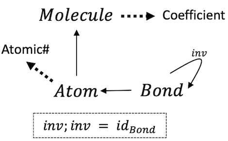

# CSetAutomorphisms.jl

[Attributed C-sets](https://arxiv.org/pdf/2106.04703.pdf) encompass a broad class of data structures, including many generalizations of graphs (e.g. [directed](https://www.algebraicjulia.org/blog/post/2020/09/cset-graphs-1/), [symmetric](https://www.algebraicjulia.org/blog/post/2020/09/cset-graphs-2), [reflexive](https://www.algebraicjulia.org/blog/post/2021/04/cset-graphs-3/)), tabular data (e.g. [data frames](https://pandas.pydata.org/pandas-docs/stable/user_guide/dsintro.html)), and combinations of the two (e.g. weighted graphs, [relational databases](https://en.wikiversity.org/wiki/Relational_Databases/Introduction)). This repo generalizes the [Nauty](https://pallini.di.uniroma1.it/Introduction.html) algorithm, which produces canonical members of an isomorphism class, to cover any data structure encompassed by C-Sets. More background will be featured in an upcoming [blog](https://www.algebraicjulia.org/blog/) post.

## Example: ACSet for chemical reactions



Note the relation between bonds and atoms is taken from [half-edge graphs](https://www.algebraicjulia.org/blog/post/2020/09/cset-graphs-2/), which encode symmetric relationships and also allow for the representation of 'dangling bonds'. This is the declaration using [Catlab.jl](https://github.com/AlgebraicJulia/Catlab.jl) (full code in `CSetAutomorphisms.jl/test/example.jl`):

```julia
using Catlab.Present, Catlab.Theories, Catlab.CategoricalAlgebra

@present TheoryRxn(FreeSchema) begin
  (Molecule, Atom, Bond)::Ob
  inv::Hom(Bond,Bond)
  atom::Hom(Bond, Atom)
  mol::Hom(Atom, Molecule)

  (Float, Num)::AttrType
  atomic_number::Attr(Atom, Num)
  coefficient::Attr(Molecule, Float)

  compose(inv, inv) == id(Bond)
end

@acset_type RxnGeneric(TheoryRxn)
Rxn = RxnGeneric{Float64, Int}
```

When considering ACSets only up to isomorphism, this representation captures many domain-specific features of the data that would not be captured by a simple `struct` of various tuples and lists of data:
 - Neither the ordering in which atoms are labeled, the ordering of atoms within bonds, nor the ordering of bonds themselves is relevant to the identity of a molecule. `H¹—O²—H³` and `H³—O¹—H²` are identically water molecules.
 - The ordering in which the reactant molecules or product molecules are listed is not relevant to the identity of the reaction: we want `2 H₂O -> 2 H₂ + O₂` to be *the same* as `2 H₂O -> O₂ + 2 H₂`
 - The atomic numbers *are* relevant to molecule identity: `CO₂` is not `H₂O` because `AtomicNumber` is an *attribute* rather than a piece of combinatorial data. Likewise for the coefficients on the reactants and products.
 - Stoichiometric coefficients distinguish a 'forward reaction' from a 'reverse reaction', which is particularly important if we wish to characterize reactions with properties such as exothermicity.

In Catlab, we can declare *both* `2 H₂O -> 2 H₂ + O₂` and `2 H₂O -> O₂ + 2 H₂` with the following code:
```julia
H2 = Rxn()
add_part!(H2, :Molecule, coefficient=2.0)
add_parts!(H2, :Atom, 2, atomic_number=[1,1], mol=[1,1])
add_parts!(H2, :Bond, 2, atom=[1,2], inv=[2,1])

O2 = deepcopy(H2)
set_subpart!(O2, :coefficient, 1.0)
set_subpart!(O2, :atomic_number, [8,8])

H2O = deepcopy(H2)
set_subpart!(H2O, :coefficient, -2.0)
add_part!(H2O, :Atom, mol=1, atomic_number=8)
add_parts!(H2O, :Bond, 4, atom=[1,3,2,3], inv=[2,1,4,3])

r1, r2 = Rxn(), Rxn()
[copy_parts!(r1, x) for x in [H2, O2, H2O]]
[copy_parts!(r2, x) for x in [H2O, H2, O2]]

println(r1 == r2) # false
println(is_isomorphic(r1, r2)) # true
```
This should convince you that the 'right' thing to do is work with `Rxn`s only up to isomorphism. While Catlab's `is_isomorphic` allows us to test whether any *pair* of ACSets is equivalent up to isomorphism (at nontrivial cost), it does not give a concrete value that represents all ACSets in its isomorphism class. One example why this may be useful: a scientist may require a canonical labeling in order to query a large database of `N` reactions and see if a particular reaction, `R`, is in the database (without having to run the expensive `is_isomorphic` function `O(N)` times). If `N` is large, then it is much preferable to compute the canonical labeling for `R` just once and do `O(N)` string equality tests.