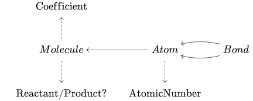

# CSetAutomorphisms.jl

[Attributed C-sets](https://arxiv.org/pdf/2106.04703.pdf) encompass a broad class of data structures, including many generalizations of graphs (e.g. [directed](https://www.algebraicjulia.org/blog/post/2020/09/cset-graphs-1/), [symmetric](https://www.algebraicjulia.org/blog/post/2020/09/cset-graphs-2), [reflexive](https://www.algebraicjulia.org/blog/post/2021/04/cset-graphs-3/)), tabular data (e.g. [data frames](https://pandas.pydata.org/pandas-docs/stable/user_guide/dsintro.html)), and combinations of the two (e.g. weighted graphs, [relational databases](https://en.wikiversity.org/wiki/Relational_Databases/Introduction)). Despite the incredible expressivity of this abstraction, C-sets are very well-behaved categorically, and implementing a simple category-theoretic concept for arbitrary C-sets often results in a very meaningful computation across this diverse spectrum of potential applications. Here, we'll discuss the basic notion of *isomorphism classes* and its relevance to applications involving C-sets.

## Equality vs equivalence: the case of graphs
A common problem that can arise in everyday conversation stems from one calling things 'the same', only to be called out as making a [false equivalence](https://en.wikipedia.org/wiki/False_equivalence) and then having to qualify 'well, not *literally* equal, but still *morally* the same' (i.e. for the purposes of the conversation at hand). Luckily, when dealing with formally-defined structures, we have control over what counts as literal equality versus some specific notion of equivalence. Let's consider directed graphs as a simple example:


These two graphs should, morally, 'be the same', even though some nodes have been shifted. If this difference *were* significant to our application at hand, it would be better to say that our application actually concerns *images of graphs*, [rather than actual graphs](https://en.wikipedia.org/wiki/The_Treachery_of_Images) themselves. A related concern appears when implementing graphs in a computer, which doesn't use images. Rather, it concisely stores the information by creating a numbering on the vertices:


The five edges could be represented with five pairs of integers, or alternatively with two vectors, one noting the arrow sources, and the other noting the arrow targets: `src=[1,1,1,1,2,3], tgt=[2,3,4,4,4]`. It's fair to ask if it should count as the same graph if we listed the arrows in a different order, such as reverse order: `src=[3,2,1,1,1], tgt=[4,4,4,3,2]`. And should it be the same graph if we keep the arrow order but identify the vertices differently?


We want the answers to these questions to be **yes**. The numeric labeling of the graph is purely an implementation detail, unrelated to the 'purely combinatorial' graph-theoretic data which notes what is connected to what. However, the computer has direct access *only* to the graph implementations, which are not equal. In general, it is a tough computational problem ([the graph isomorphism problem](https://en.wikipedia.org/wiki/Graph_isomorphism_problem)) to answer whether two graphs are equal in this richer, meaningful sense because it involves searching over all possible reorderings of the label indices. The problem gets worse if we are frequently searching if a graph exists within some database of `N` graphs: each time we query, we'd have to solve the graph isomorphism problem `O(N)` times! A solution to this problem is to find a *canonical labeling* (or *canonical automorphism*), such that the labelings of two graphs are equal if and only if they are isomorphic. This labeling can then be hashed to yield a small fingerprint that can be compared to quickly check if the graph of interest is in the database. If this problem is solved, querying a database (which has stored canonical label information) now merely require the canonical labeling to be computed on just our *one* graph of interest.

## Working Example: ACSet for chemical reactions
Much time and effort has been spent crafting efficient algorithms to solve the canonical graph labeling problem, with the most popular software being [Nauty](https://pallini.di.uniroma1.it/Introduction.html), written in C. Most high-level languages that solve this problem do so by constructing input that is passed to the original Nauty program. However, what should be done if we care about whether two things are the same that aren't graphs? For example, the attributed C-Set (ACSet) representing chemical reactions, specified by the following schema:



This is the declaration in [Catlab.jl](https://github.com/AlgebraicJulia/Catlab.jl) (full code in `CSetAutomorphisms.jl/test/example.jl`):

```julia
using Catlab.Present, Catlab.Theories, Catlab.CategoricalAlgebra

@present TheoryRxn(FreeSchema) begin
  (Molecule, Atom, Bond)::Ob
  (b₁, b₂)::Hom(Bond,Atom)
  mol_in::Hom(Atom, Molecule)

  (Float, Num, YesNo)::AttrType
  atomic_number::Attr(Atom, Num)
  coefficient::Attr(Molecule, Float)
  is_reactant::Attr(Molecule, YesNo)
end

@acset_type RxnGeneric(TheoryRxn)
Rxn = RxnGeneric{Float64, Int, Bool}
```

The ACSet representation captures many domain-specific features of the data that are not captured by representing the reaction as a simple `struct` of various tuples and lists of data:
 - The ordering in which atoms are labeled or bonds are listed is not relevant to the identity of a molecule (this portion of the schema is isomorphic to the schema for directed graphs). `H#1--O#2--H#3` and `H#3--O#1--H#2` are identically water molecules.
 - The ordering in which the reactant molecules or product molecules are listed is not relevant to the identity of the reaction: we want `2 H₂O -> 2 H₂ + O₂` to be *the same* as `2 H₂O -> O₂ + 2 H₂`
 - The atomic numbers *are* relevant to molecule identity: `CO₂` is not `H₂O` because `AtomicNumber` is an *attribute* rather than a piece of combinatorial data. Likewise for the coefficients on the reactants and products.
 - A 'forward reaction' is different from a 'reverse reaction', which is particularly important if we wish to characterize reactions with properties such as exothermicity.

In Catlab, we can declare *both* `2 H₂O -> 2 H₂ + O₂` and `2 H₂O -> O₂ + 2 H₂` with the following code:
```julia
H2 = Rxn()
add_part!(H2, :Molecule, coefficient=2.0, is_reactant=false)
add_parts!(H2, :Atom, 2, atomic_number=[1,1], mol_in=[1,1])
add_part!(H2, :Bond, b₁=1, b₂=2)
O2 = deepcopy(H2)
set_subpart!(O2, :atomic_number, [8,8])
set_subpart!(O2, :coefficient, 1.0)
H2O = deepcopy(H2)
set_subpart!(H2O, :is_reactant, true)
add_part!(H2O, :Atom, mol_in=1, atomic_number=8)
add_parts!(H2O, :Bond, 2, b₁=[3,3], b₂=[1,2])
r1, r2 = Rxn(), Rxn()
[copy_parts!(r1, x) for x in [H2, O2, H2O]]
[copy_parts!(r2, x) for x in [H2O, H2, O2]]

println(r1 == r2) # false
println(is_isomorphic(r1, r2)) # true
```
Catlab's `is_isomorphic` offers a solution to the graph isomorphism problem that works generically for any ACSet. It is based on reframing the task as a constraint satisfaction problem, solvable with a backtracking search. However, returning to the paradigm use case for canonical automorphisms, a scientist requires a canonical labeling in order to query a large database of reactions and see if a particular reaction is inside. This problem is addressed in [CSetAutomorphisms.jl](https://github.com/AlgebraicJulia/CSetAutomorphisms.jl) where we generalize the Nauty algorithm beyond graphs to attributed C-sets. The brief summary below, as well as the implementation, are based on this lucid [expository paper](https://www.math.unl.edu/~aradcliffe1/Papers/Canonical.pdf) on the Nauty algorithm.

## Generalized Nauty Algorithm

TBD

## Outlook
This is an exciting development because it enables hashing C-sets, a crucial operation for many algorithms. In particular, for dynamic programming algorithms, one can now incorporate C-sets into a state space and quickly check whether a state has already been seen. Alternatively, for many statistical mechanics applications, we care about the number of distinct isomorphism classes (related to the `N!` factor in the denominator of [partition functions](https://en.wikipedia.org/wiki/Partition_function_(statistical_mechanics)#Partition_functions_of_subsystems)). There remains a lot of work to be done, especially in the field of performance gains, both algorithmically as well as implementation-wise (using Julia's tools for fine tuning compiler optimizations).